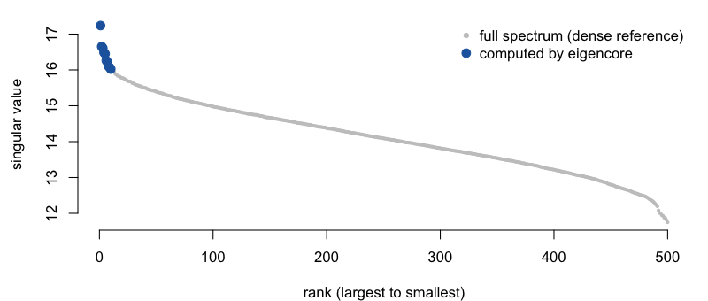
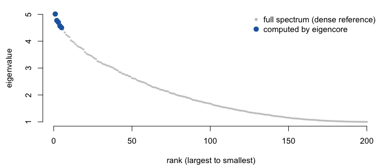

<!-- README.md is generated from README.Rmd. Please edit that file. -->

# eigencore

**eigencore** computes the top-*k* singular triplets or eigenpairs of a
large sparse or structured matrix in R — the computation behind PCA on
big sparse data, spectral embeddings, LSA, and low-rank approximation.
It runs on native C++ kernels and attaches a numerical certificate to
every result, so you know the answer is right, not just that the solver
stopped.

If you use **RSpectra**, **irlba**, or **PRIMME** for these problems,
eigencore does the same job and adds two things:

1.  **Every result is checked.** Each call returns residuals, a
    backward-error bound, orthogonality loss, and a single
    `passed`/`failed` flag. When a bound can only be estimated, the
    certificate says so instead of passing.
2.  **Centering and scaling without densifying.** Centering a sparse
    matrix for PCA normally forces a dense copy. eigencore solves the
    centered (or scaled, or composed) problem directly — the dense
    matrix is never formed.

On PCA-shaped sparse SVD problems it is also 1.6×–24× faster than
RSpectra, irlba, and PRIMME (see [Benchmarks](#benchmarks)).

## Installation

``` r
# install.packages("pak")
pak::pak("bbuchsbaum/eigencore")
```

## Quick start

The top 10 singular triplets of a 100,000 × 500 sparse matrix — the core
computation in sparse PCA and LSA:

``` r
library(eigencore)
library(Matrix)

set.seed(2)
A <- as(rsparsematrix(100000, 500, density = 0.002), "dgCMatrix")

fit <- svd_partial(A, rank = 10, target = largest())
fit
#> Partial SVD
#>   requested rank: 10 
#>   converged rank: 10 
#>   method: native certified Gram SVD special case 
#>   target: largest 
#>   max residual: 1.388377e-14 
#>   max backward error: 4.392928e-17 
#>   max orthogonality loss: 1.776357e-15 
#>   norm bound: frobenius_exact 
#>   scale estimated: FALSE 
#>   certificate: passed
```

The printout names the kernel that ran, gives the worst residual,
backward error, and orthogonality loss across the returned triplets, and
shows the certificate passed with an exact norm bound. The solve takes
15 ms — 1.6× faster than RSpectra, 9× faster than irlba, 2.7× faster
than PRIMME (see [Benchmarks](#benchmarks)).



## Certificates

An iterative solver can stop early, miss a cluster, or lose
orthogonality and still return plausible-looking numbers. RSpectra,
irlba, and PRIMME hand you vectors and values; checking them is your
problem. eigencore checks both singular relations (`||A v - sigma u||`
and `||A^T u - sigma v||`) and hands you the evidence:

``` r
fit$certificate
#> eigencore certificate
#>   passed: TRUE 
#>   tolerance: 1e-08 
#>   type: residual_backward_error 
#>   norm bound: frobenius_exact 
#>   scale estimated: FALSE 
#>   max residual: 1.388377e-14 
#>   max backward error: 4.392928e-17 
#>   max orthogonality loss: 1.776357e-15 
#>   orthogonality tolerance: 1.490116e-08 
#>   orthogonality required: TRUE
```

When the check cannot be made exact, the certificate says so. For a
**column-centered** sparse matrix the only cheap norm bound is a
stochastic estimate, so eigencore returns the singular values but sets
`passed = FALSE` and tells you why:

``` r
cen <- svd_partial(center(A, columns = TRUE), rank = 5, target = largest())

cen$certificate$passed
#> [1] FALSE
cen$certificate$norm_bound_type
#> [1] "frobenius_hutchinson_estimate"
cen$certificate$notes
#> [1] "certificate scale uses a stochastic norm estimate; passed is withheld"
```

You decide whether an estimated bound is good enough for your analysis.
Other solvers don’t give you the choice — they return the same numbers
with no flag.

## Center and scale without densifying

A dense centered copy of `A` would occupy **400 MB**; the sparse
original is a few MB. `center()` gives you the centered map as an
*operator*, and the solver works through it directly:

``` r
A_centered <- center(A, columns = TRUE)        # a 100000 x 500 operator, not a matrix
svd_partial(A_centered, rank = 5, target = largest())$d
#> [1] 17.23701 16.65319 16.60961 16.48647 16.44760
```

Build operators with `linear_operator()`, combine them with `compose()`,
`crossprod_operator()`, `scale_cols()`, `center()`, and friends. The
planner picks the kernel from the structure; `plan_solver()` shows the
choice before you commit to a long solve:

``` r
plan_solver(svd_problem(A_centered, target = largest()), rank = 5)$method
#> [1] "native matrix-free Golub-Kahan callback cycle + native Ritz extraction (callback boundary)"
```

## Smallest eigenvalues of a symmetric operator

The same interface handles symmetric eigenproblems. Here is a sparse
second-difference operator (a 1-D graph Laplacian) of size 20,000,
asking for its **smallest** eigenvalues — the hard end of the spectrum
for iterative solvers:

``` r
n <- 20000
L <- bandSparse(n, n, k = c(-1, 0, 1),
                diagonals = list(rep(-1, n - 1), rep(2, n), rep(-1, n - 1)))
L <- as(L, "dgCMatrix")

eig <- eig_partial(L, k = 8, target = smallest())
eig
#> Partial eigen decomposition
#>   requested: 8
#>   converged: 8
#>   method: native tridiagonal Hermitian shift-invert (factorized Lanczos)
#>   target: smallest
#>   restart: native_tridiagonal_shift_invert_lanczos
#>   locked: 0
#>   max residual: 9.026588e-10
#>   max backward error: 2.605773e-12
#>   max orthogonality loss: 6.439294e-15
#>   norm bound: frobenius_metadata+identity_exact
#>   scale estimated: FALSE
#>   certificate: passed
```

eigencore solves this in 31 ms, certificate passed. The same call
through RSpectra’s default mode (`which = "SA"`) does not converge on
this matrix — 0 of 8 eigenvalues after 2.7 s. RSpectra is fast here if
you know to switch it to shift-invert mode (`sigma = 0` solves it in 13
ms); eigencore makes that choice for you and certifies the result. The
exact spectrum is known in closed form, so the answer can be checked
directly:



## Benchmarks

Median wall-clock time. eigencore’s column includes computing the
certificate; the baseline columns are solve only. Reproduce with
`Rscript inst/benchmarks/bench-readme.R`.

| Problem (all certified `passed` by eigencore) | eigencore | vs RSpectra | vs irlba | vs PRIMME |
|----|----|----|----|----|
| Tall sparse SVD, 100000 × 500, k = 10 | 15 ms | **1.6× faster** | **9.1× faster** | **2.7× faster** |
| Wide sparse SVD, 500 × 100000, k = 10 | 12 ms | **12.0× faster** | **24.1× faster** | **14.0× faster** |
| Banded Hermitian, smallest, n = 20000, k = 8 | 31 ms | see note¹ | — | — |

<sub>R 4.5.1 · aarch64-apple-darwin20 · RSpectra 0.16.2 / irlba 2.3.7 /
PRIMME 3.2.6. The SVD rows also allocate ~6–8× less memory than irlba.
Rerun the script for numbers on your machine and BLAS.</sub>

<sub>¹ RSpectra’s default mode (`which = "SA"`) returns 0 of 8
eigenvalues on this matrix after 2.7 s. Its shift-invert mode
(`sigma = 0`) solves it in 13 ms — faster than eigencore — if you know
to reach for it. eigencore picks the method itself and certifies the
result.</sub>

The SVD speedups come from a certified Gram kernel for tall/wide sparse
problems whose small dimension is ≤ 512 (≤ 1024 for wide matrices).
Outside that — a tall SVD with more than 512 columns, or a general
sparse matrix like a 2-D-grid Laplacian — RSpectra is currently 2–6.5×
faster on the cases we measure, narrowing to parity on the larger grid
(n = 40,000). `fit$method` always names the path that ran, so there is
no guessing.

## When to use what

Use **eigencore** for tall or wide sparse SVD (PCA-shaped problems), the
smallest eigenvalues of banded or structured symmetric operators
(certified, no mode tuning), centered or scaled or composed operators,
and anywhere you want the result checked rather than taken on faith.

Use **RSpectra or irlba** for general large sparse problems outside
those shapes, and RSpectra’s shift-invert mode when raw speed on
smallest or interior eigenvalues matters more than a certificate.
Switching in either direction is a one-line change, because eigencore
ships drop-in wrappers with the same arguments:

``` r
res <- eigs_sym(L, k = 8, which = "SA")
res$values
#> [1] 2.467154e-08 9.868617e-08 2.220439e-07 3.947447e-07 6.167886e-07
#> [6] 8.881755e-07 1.208906e-06 1.578979e-06
res$certificate$passed
#> [1] TRUE
```

`eigs()`, `eigs_sym()`, and `svds()` accept the same `which` codes as
RSpectra (`"LM"`, `"SM"`, `"LA"`, `"SA"`, `"LR"`, `"SR"`, `"LI"`,
`"SI"`, `"BE"`) and additionally return a certificate.

## Learning more

`vignette("eigencore", package = "eigencore")` is the guided tour.
`vignette("certificates", package = "eigencore")` explains how to read
the numerical evidence and what to do when a check fails.

## Status

eigencore 1.0.0 is headed for CRAN. The exported API is stable — it is
frozen by a snapshot test, and breaking changes follow semantic
versioning from here. The numerics are solid: every shipped solver path
is benchmarked against RSpectra and PRIMME, covered by an adversarial
test suite, and certified on every call. Problem classes without a
native kernel yet — general matrix-free SVD, interior eigenvalues at
scale, nonsymmetric Krylov–Schur — are labeled `reference` in
`fit$method` rather than quietly slow. See
[`docs/method-selection-and-workflows.md`](docs/method-selection-and-workflows.md)
for the workflow map,
[`docs/v1-benchmark-manifest.md`](docs/v1-benchmark-manifest.md) for the
benchmark inventory, and
[`docs/known-limitations.md`](docs/known-limitations.md) for current
boundaries.

## License

MIT © Bradley Buchsbaum.
