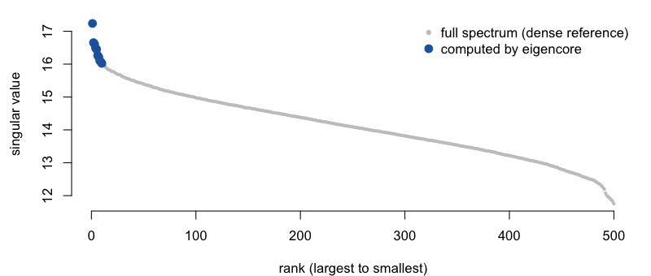
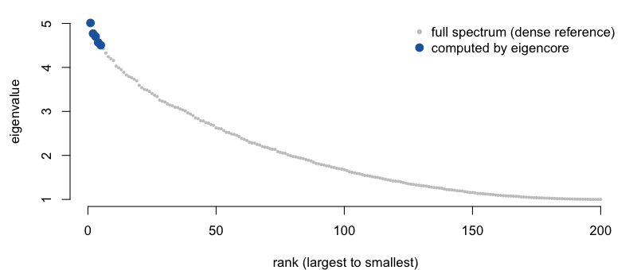

<!-- README.md is generated from README.Rmd. Please edit that file. -->

# eigencore

<!-- badges: start -->

[](https://github.com/bbuchsbaum/eigencore/actions/workflows/R-CMD-check.yaml)
[](https://bbuchsbaum.github.io/eigencore/)
[](https://app.codecov.io/gh/bbuchsbaum/eigencore)
[](https://github.com/bbuchsbaum/eigencore/actions/workflows/test-coverage.yaml)
<!-- badges: end -->

[Documentation](https://bbuchsbaum.github.io/eigencore/) ·
[Getting started](https://bbuchsbaum.github.io/eigencore/articles/eigencore.html) ·
[Reference](https://bbuchsbaum.github.io/eigencore/reference/) ·
[Changelog](NEWS.md)

**eigencore** computes the top-*k* singular triplets or eigenpairs of a
large sparse or structured matrix in R — the computation behind PCA on
big sparse data, spectral embeddings, LSA, and low-rank approximation.
It also certifies real symmetric positive-semidefinite (PSD) geometry,
including singular forms whose null spaces must remain explicit.

eigencore focuses on three things:

1.  **Every result is checked.** Each call returns residuals, a
    backward-error bound, orthogonality loss, and a single
    `passed`/`failed` flag. When a bound can only be estimated, the
    certificate says so instead of passing.
2.  **Centering and scaling without densifying.** Explicitly centering a
    sparse matrix for PCA can require a dense copy. eigencore solves the
    centered (or scaled, or composed) problem as an operator, without
    forming that copy.
3.  **PSD actions match their evidence.** Complete dense and diagonal
    factors expose roots, pseudoinverses, projectors, and image
    reduction. Structural sparse Gram and Laplacian factors expose only
    what their construction proves, and unsupported requests fail before
    dense fallback.

Supported structured problems run through fast native kernels. The
[Benchmarks](#benchmarks) section provides reproducible single-machine
timings without treating them as cross-package rankings.

## Installation

``` r
# install.packages("pak")
pak::pak("bbuchsbaum/eigencore")
```

## Quick start

The top 10 singular triplets of a 100,000 × 500 sparse matrix — the core
computation in sparse PCA and LSA:

``` r
library(eigencore)
library(Matrix)

set.seed(2)
A <- as(rsparsematrix(100000, 500, density = 0.002), "dgCMatrix")

fit <- svd_partial(A, rank = 10, target = largest())
fit
#> Partial SVD
#>   requested rank: 10
#>   converged rank: 10
#>   method: native certified Gram SVD special case
#>   target: largest
#>   max residual: 1.414065e-14
#>   max backward error: 4.474206e-17
#>   max orthogonality loss: 1.554312e-15
#>   norm bound: frobenius_exact
#>   scale estimated: FALSE
#>   certificate: passed
```

The printout names the kernel that ran, gives the worst residual,
backward error, and orthogonality loss across the returned triplets, and
shows the certificate passed with an exact norm bound. This problem uses
the native certified Gram path; see [Benchmarks](#benchmarks) for a
reproducible timing on the development machine.



## Certificates

An iterative solver can stop early, miss a cluster, or lose
orthogonality and still return plausible-looking numbers. eigencore
makes validation part of the returned result: it checks both singular
relations (`||A v - sigma u||` and `||A^T u - sigma v||`) and exposes
the evidence:

``` r
fit$certificate
#> eigencore certificate
#>   passed: TRUE
#>   tolerance: 1e-08
#>   type: residual_backward_error
#>   norm bound: frobenius_exact
#>   scale estimated: FALSE
#>   max residual: 1.414065e-14
#>   max backward error: 4.474206e-17
#>   max orthogonality loss: 1.554312e-15
#>   orthogonality tolerance: 1.490116e-08
#>   orthogonality required: TRUE
```

When the check cannot be made exact, the certificate says so. For a
**column-centered** sparse matrix the only cheap norm bound is a
stochastic estimate, so eigencore returns the singular values but sets
`passed = FALSE` and tells you why:

``` r
cen <- svd_partial(center(A, columns = TRUE), rank = 5, target = largest())

cen$certificate$passed
#> [1] FALSE
cen$certificate$norm_bound_type
#> [1] "frobenius_hutchinson_estimate"
cen$certificate$notes
#> [1] "certificate scale uses a stochastic norm estimate; passed is withheld"
```

You decide whether an estimated bound is good enough for your analysis.
The explicit flag lets downstream code distinguish an exact certificate
from an estimate without inferring that distinction from solver
convergence alone.

## Certified singular PSD geometry

A singular PSD form is a seminorm on the original coordinates and a
genuine metric only on its image, or on the quotient by its null space.
Certify the form once, inspect its numerical rank, and reduce data
explicitly before an algorithm that requires an inner product:

``` r
L_metric <- matrix(c(
  1, 0, 1,
  0, 1, 1
), 2, 3, byrow = TRUE)
K <- crossprod(L_metric)

K_factor <- psd_factor(K)
c(rank = psd_rank(K_factor), nullity = psd_nullity(K_factor))
#>    rank nullity
#>       2       1

X_metric <- matrix(c(
  1, 2, 3,
  3, 2, 1
), 3, 2)
X_image <- psd_reduce(K_factor, X_metric)

stopifnot(isTRUE(all.equal(
  crossprod(X_image),
  psd_gram(K_factor, X_metric),
  tolerance = 1e-12
)))
```

`psd_capabilities(K_factor)` is the runtime manifest. Identity,
diagonal, dense spectral, and dense Gram factors have complete numerical
paths. Sparse Gram and graph-Laplacian constructors preserve sparse
state and intentionally withhold roots, projectors, and numerical rank
unless their evidence supports those actions. Generic sparse matrices
and opaque callbacks are not promoted to certified factors from storage
or metadata alone.

`psd_apply(K_factor, b, "pseudoinverse")` is defined for every finite
`b`, but `psd_solve(K_factor, b)` is stricter: it rejects a right-hand
side with a null component because the original equation `K x = b` has
no solution. See `vignette("psd-geometry")` for the complete capability
table, tolerance and repair semantics, sparse constructors, block
primitives, persistence, and the explicit reduction path for singular
generalized eigenproblems.

## Center and scale without densifying

A dense centered copy of `A` would occupy **400 MB**; the sparse
original is a few MB. `center()` gives you the centered map as an
*operator*, and the solver works through it directly:

``` r
A_centered <- center(A, columns = TRUE)        # a 100000 x 500 operator, not a matrix
svd_partial(A_centered, rank = 5, target = largest())$d
#> [1] 17.23701 16.65319 16.60961 16.48647 16.44760
```

Build operators with `linear_operator()`, combine them with `compose()`,
`crossprod_operator()`, `scale_cols()`, `center()`, and friends. The
planner picks the kernel from the structure. `plan_solver()` returns an
executable, frozen record: `solve(plan)` runs that inspected route,
while `solve(problem)` creates a fresh plan under current policy.
Results report both the planned and actual runtime methods when a
certification fallback is needed:

``` r
plan <- plan_solver(svd_problem(A_centered, target = largest()), rank = 5)
plan$method
#> [1] "native matrix-free Golub-Kahan callback cycle + native Ritz extraction (callback boundary)"
```

Use `work(result)` for cross-solver accounting. It keeps forward,
adjoint, metric, preconditioner, and certification calls and columns
separate; `result$matvecs` remains the route-specific compatibility
field.

For repeated standard Hermitian Lanczos solves, opt into reusable state
through an executable plan. The retained object is an acceleration hint,
not a saved certificate: every solve still applies and certifies the
current operator.

``` r
workflow_matrix <- diag(seq(60, 1))
workflow_plan <- plan_solver(
  eigen_problem(workflow_matrix, target = largest()),
  k = 3,
  method = lanczos(block = 3, max_subspace = 24),
  tol = 1e-8
)
first_workflow <- solve(workflow_plan, retain_state = "same_operator")
second_workflow <- solve(
  workflow_plan,
  restart_state = restart_state(first_workflow, retention = "same_operator"),
  reuse = "same_operator"
)
stopifnot(
  certificate(second_workflow)$passed,
  second_workflow$state_transition$method_state_used
)
```

`reuse = "auto"` keeps only the public basis after a
coordinate-compatible operator revision; `reuse = "basis_only"` always
ignores method payloads. Unsupported SVD, generalized, transformed,
Arnoldi, LOBPCG, and dense-fallback receiving routes fail rather than
silently running cold.

## Smallest eigenvalues of a symmetric operator

The same interface handles symmetric eigenproblems. Here is a sparse
second-difference operator (a 1-D graph Laplacian) of size 20,000,
asking for its **smallest** eigenvalues — the hard end of the spectrum
for iterative solvers:

``` r
n <- 20000
L <- bandSparse(n, n, k = c(-1, 0, 1),
                diagonals = list(rep(-1, n - 1), rep(2, n), rep(-1, n - 1)))
L <- as(L, "dgCMatrix")

eig <- eig_partial(L, k = 8, target = smallest())
eig
#> Partial eigen decomposition
#>   requested: 8
#>   converged: 8
#>   method: native tridiagonal Hermitian shift-invert (factorized Lanczos)
#>   target: smallest
#>   restart: native_tridiagonal_shift_invert_lanczos
#>   locked: 0
#>   max residual: 7.236489e-10
#>   max backward error: 2.089012e-12
#>   max orthogonality loss: 3.552714e-15
#>   norm bound: frobenius_metadata+identity_exact
#>   scale estimated: FALSE
#>   certificate: passed
```

The planner selects a native tridiagonal shift-invert path and the
resulting certificate passes. The exact spectrum is known in closed
form, so the answer can also be checked directly:



## Benchmarks

These are median wall-clock times for eigencore on one development
machine. They include certificate computation and are intended as a
reproducible performance smoke test, not a cross-package ranking or a
performance guarantee. Reproduce them with
`Rscript inst/benchmarks/bench-readme.R`.

| Problem (certificate `passed`) | Median time | Planner path |
|----|---:|----|
| Tall sparse SVD, 100000 × 500, k = 10 | 15 ms | native certified Gram SVD special case |
| Wide sparse SVD, 500 × 100000, k = 10 | 12 ms | native certified Gram SVD special case |
| Banded Hermitian, smallest, n = 20000, k = 8 | 31 ms | native tridiagonal Hermitian shift-invert |

<sub>Measured with R 4.5.1 on aarch64-apple-darwin20. Timings depend on
the processor, BLAS/LAPACK, package versions, sparsity pattern, and
workload; rerun the script before making performance decisions.</sub>

The SVD rows use a bounded Gram kernel for tall or wide sparse problems
whose small dimension is ≤ 512 (≤ 1024 for wide matrices). Other shapes
may select different paths with different costs. `fit$method` always
names the path that ran, making the relevant implementation boundary
visible.

That path has fixed work associated with solving the smaller Gram
problem and constructing a certified result. On the tiny examples used
in documentation smoke tests, this overhead can dominate and `RSpectra`
or `irlba` may finish sooner. As the long dimension grows while the
smaller dimension remains within the planner boundary, the same path can
cross over and become faster. This is a shape-specific effect, not a
claim that eigencore becomes faster whenever a matrix gets larger; the
[benchmark
vignette](https://bbuchsbaum.github.io/eigencore/articles/benchmarks.html)
explains the comparison and its limits.

## When to use what

Use **eigencore** for tall or wide sparse SVD (PCA-shaped problems), the
smallest eigenvalues of banded or structured symmetric operators
(certified, with automatic planner selection), centered or scaled or
composed operators, dense generalized eigen/QZ/GSVD compatibility work
through `eig_full()`, `generalized_schur()`, and `generalized_svd()`,
and workflows where explicit certificate metadata is useful.

For workloads outside those structured paths, benchmark the candidate
packages on your own matrices and hardware rather than assuming any
implementation will be fastest. Side-by-side evaluation is
straightforward because eigencore ships RSpectra-compatible wrappers
with the same arguments:

``` r
res <- eigs_sym(L, k = 8, which = "SA")
res$values
#> [1] 2.467154e-08 9.868617e-08 2.220439e-07 3.947447e-07 6.167886e-07
#> [6] 8.881755e-07 1.208906e-06 1.578979e-06
res$certificate$passed
#> [1] TRUE
```

`eigs()`, `eigs_sym()`, and `svds()` accept the same `which` codes as
RSpectra (`"LM"`, `"SM"`, `"LA"`, `"SA"`, `"LR"`, `"SR"`, `"LI"`,
`"SI"`, `"BE"`) and additionally return a certificate.

## Learning more

The [package website](https://bbuchsbaum.github.io/eigencore/) hosts the
reference and articles, including
[certificates](https://bbuchsbaum.github.io/eigencore/articles/certificates.html)
and
[PSD geometry](https://bbuchsbaum.github.io/eigencore/articles/psd-geometry.html).
Installed vignettes remain available as
`vignette("eigencore", package = "eigencore")` and
`vignette("certificates", package = "eigencore")`.

## Status

eigencore 1.3.0 is the current GitHub release (`v1.3.0`). CRAN currently
publishes 1.0.3. The 1.3.0 additive API includes certified real-double
PSD factors, image-space reduction, strict singular solves, metric block
primitives, dense Gram factors, and non-densifying structural sparse
Gram and graph-Laplacian paths. The generalized-eigen `B`/`metric=`
surface remains SPD-only; singular forms use explicit image reduction.
The exported API is frozen by snapshot tests, and breaking changes
follow semantic versioning. Unsupported solver or PSD capability
families remain visibly unavailable rather than silently falling back.

## License

MIT © Bradley Buchsbaum.
