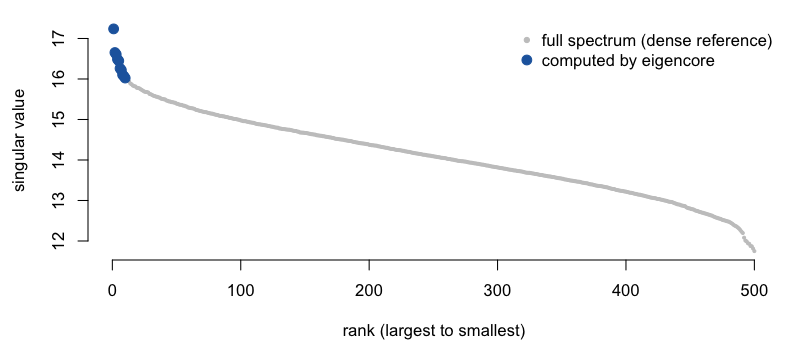
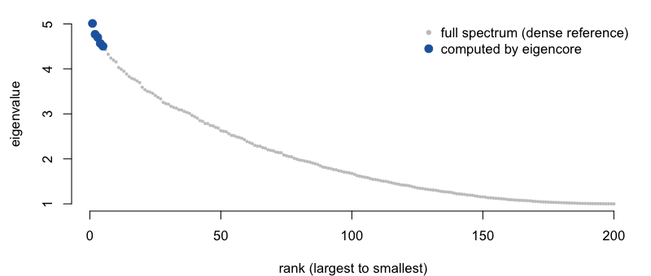

<!-- README.md is generated from README.Rmd. Please edit that file. -->

# eigencore

**eigencore** computes the top-*k* singular triplets or eigenpairs of a
large sparse or structured matrix in R — the computation behind PCA on
big sparse data, spectral embeddings, LSA, and low-rank approximation.
It also certifies real symmetric positive-semidefinite (PSD) geometry,
including singular forms whose null spaces must remain explicit.

eigencore focuses on three things:

1.  **Every result is checked.** Each call returns residuals, a
    backward-error bound, orthogonality loss, and a single
    `passed`/`failed` flag. The backward error uses the standard 2-norm
    definition with a denominator that never exceeds `||A||_2`, so a
    certificate can only over-state the error.
2.  **Centering and scaling without densifying.** Explicitly centering a
    sparse matrix for PCA can require a dense copy. eigencore solves the
    centered (or scaled, or composed) problem as an operator, without
    forming that copy.
3.  **PSD actions match their evidence.** Complete dense and diagonal
    factors expose roots, pseudoinverses, projectors, and image
    reduction. Structural sparse Gram and Laplacian factors expose only
    what their construction proves, and unsupported requests fail before
    dense fallback.

Supported structured problems run through fast native kernels. The
[Benchmarks](#benchmarks) section compares them with RSpectra, irlba and
base R using stored, reproducible results with independent accuracy
checks.

## Installation

``` r
# install.packages("pak")
pak::pak("bbuchsbaum/eigencore")
```

## Quick start

The top 10 singular triplets of a 100,000 × 500 sparse matrix — the core
computation in sparse PCA and LSA:

``` r
library(eigencore)
library(Matrix)

set.seed(2)
A <- as(rsparsematrix(100000, 500, density = 0.002), "dgCMatrix")

fit <- svd_partial(A, rank = 10, target = largest())
fit
#> Partial SVD
#>   requested rank: 10
#>   converged rank: 10
#>   method: native certified Gram SVD special case
#>   target: largest
#>   max residual: 1.736519e-14
#>   max backward error: 1.007435e-15
#>   max orthogonality loss: 1.332268e-15
#>   norm bound: two_norm_lower_bound
#>   scale estimated: FALSE
#>   certificate: passed
```

The printout names the kernel that ran, gives the worst residual,
backward error, and orthogonality loss across the returned triplets, and
shows the certificate passed. The backward error divides by a lower
bound on `||A||_2` (`two_norm_lower_bound`), so it can only over-state
the true normwise backward error. This problem uses the native certified
Gram path; see [Benchmarks](#benchmarks) for reproducible timings.



## Certificates

An iterative solver can stop early, miss a cluster, or lose
orthogonality and still return plausible-looking numbers. eigencore
makes validation part of the returned result: it checks both singular
relations (`||A v - sigma u||` and `||A^T u - sigma v||`) and exposes
the evidence:

``` r
fit$certificate
#> eigencore certificate
#>   passed: TRUE
#>   tolerance: 1e-08
#>   type: residual_backward_error
#>   norm bound: two_norm_lower_bound
#>   norm source: applied_vectors
#>   scale estimated: FALSE
#>   max residual: 1.736519e-14
#>   max backward error: 1.007435e-15
#>   max orthogonality loss: 1.332268e-15
#>   orthogonality tolerance: 1.490116e-08
#>   orthogonality required: TRUE
```

The backward error is the standard normwise one,
`max residual / ||A||_2` for an SVD and
`||A x - lambda x|| / ((||A||_2 + |lambda|) ||x||)` for an eigenpair. The
exact `||A||_2` is rarely available, so eigencore divides by a value
that never exceeds it: the exact norm where it is cheap (diagonal
matrices, a full computed spectrum), otherwise the largest of the column
norms, the `||A x|| / ||x||` ratios of the returned vectors, and, only
when that could change the verdict, a short deterministic Lanczos
estimate. A smaller denominator makes the reported backward error
larger, so `passed` is never optimistic. `norm_bound_type` says whether
the scale was exact or a lower bound, and `norm_source` says where it
came from.

This also covers operators with no cheap norm at all, such as a
**double-centered** sparse matrix, which eigencore never forms
explicitly:

``` r
cen <- svd_partial(center(A, rows = TRUE, columns = TRUE), rank = 5,
                    target = largest())

cen$certificate$passed
#> [1] TRUE
cen$certificate$norm_bound_type
#> [1] "two_norm_lower_bound"
cen$certificate$norm_source
#> [1] "applied_vectors"
```

If a pair’s residual is not small relative to this scale, the
certificate fails and `failed_indices` names the offending pairs; the
explicit flag lets downstream code act on that without inferring it from
solver convergence.

## Certified singular PSD geometry

A singular PSD form is a seminorm on the original coordinates and a
genuine metric only on its image, or on the quotient by its null space.
Certify the form once, inspect its numerical rank, and reduce data
explicitly before an algorithm that requires an inner product:

``` r
L_metric <- matrix(c(
  1, 0, 1,
  0, 1, 1
), 2, 3, byrow = TRUE)
K <- crossprod(L_metric)

K_factor <- psd_factor(K)
c(rank = psd_rank(K_factor), nullity = psd_nullity(K_factor))
#>    rank nullity
#>       2       1

X_metric <- matrix(c(
  1, 2, 3,
  3, 2, 1
), 3, 2)
X_image <- psd_reduce(K_factor, X_metric)

stopifnot(isTRUE(all.equal(
  crossprod(X_image),
  psd_gram(K_factor, X_metric),
  tolerance = 1e-12
)))
```

`psd_capabilities(K_factor)` is the runtime manifest. Identity,
diagonal, dense spectral, and dense Gram factors have complete numerical
paths. Sparse Gram and graph-Laplacian constructors preserve sparse
state and intentionally withhold roots, projectors, and numerical rank
unless their evidence supports those actions. Generic sparse matrices
and opaque callbacks are not promoted to certified factors from storage
or metadata alone.

`psd_apply(K_factor, b, "pseudoinverse")` is defined for every finite
`b`, but `psd_solve(K_factor, b)` is stricter: it rejects a right-hand
side with a null component because the original equation `K x = b` has
no solution. See `vignette("psd-geometry")` for the complete capability
table, tolerance and repair semantics, sparse constructors, block
primitives, persistence, and the explicit reduction path for singular
generalized eigenproblems.

## Center and scale without densifying

A dense centered copy of `A` would occupy **400 MB**; the sparse
original is a few MB. `center()` gives you the centered map as an
*operator*, and the solver works through it directly:

``` r
A_centered <- center(A, columns = TRUE)        # a 100000 x 500 operator, not a matrix
svd_partial(A_centered, rank = 5, target = largest())$d
#> [1] 17.23701 16.65319 16.60961 16.48647 16.44760
```

Build operators with `linear_operator()`, combine them with `compose()`,
`crossprod_operator()`, `scale_cols()`, `center()`, and friends. The
planner picks the kernel from the structure. `plan_solver()` returns an
executable, frozen record: `solve(plan)` runs that inspected route,
while `solve(problem)` creates a fresh plan under current policy.
Results report both the planned and actual runtime methods when a
certification fallback is needed:

``` r
plan <- plan_solver(svd_problem(A_centered, target = largest()), rank = 5)
plan$method
#> [1] "native matrix-free Golub-Kahan callback cycle + native Ritz extraction (callback boundary)"
```

Use `work(result)` for cross-solver accounting. It keeps forward,
adjoint, metric, preconditioner, and certification calls and columns
separate; `result$matvecs` remains the route-specific compatibility
field.

For repeated standard Hermitian Lanczos solves, opt into reusable state
through an executable plan. The retained object is an acceleration hint,
not a saved certificate: every solve still applies and certifies the
current operator.

``` r
workflow_matrix <- diag(seq(60, 1))
workflow_plan <- plan_solver(
  eigen_problem(workflow_matrix, target = largest()),
  k = 3,
  method = lanczos(block = 3, max_subspace = 24),
  tol = 1e-8
)
first_workflow <- solve(workflow_plan, retain_state = "same_operator")
second_workflow <- solve(
  workflow_plan,
  restart_state = restart_state(first_workflow, retention = "same_operator"),
  reuse = "same_operator"
)
stopifnot(
  certificate(second_workflow)$passed,
  second_workflow$state_transition$method_state_used
)
```

`reuse = "auto"` keeps only the public basis after a
coordinate-compatible operator revision; `reuse = "basis_only"` always
ignores method payloads. Unsupported SVD, generalized, transformed,
Arnoldi, LOBPCG, and dense-fallback receiving routes fail rather than
silently running cold.

## Smallest eigenvalues of a symmetric operator

The same interface handles symmetric eigenproblems. Here is a sparse
second-difference operator (a 1-D graph Laplacian) of size 20,000,
asking for its **smallest** eigenvalues — the hard end of the spectrum
for iterative solvers:

``` r
n <- 20000
L <- bandSparse(n, n, k = c(-1, 0, 1),
                diagonals = list(rep(-1, n - 1), rep(2, n), rep(-1, n - 1)))
L <- as(L, "dgCMatrix")

eig <- eig_partial(L, k = 8, target = smallest())
eig
#> Partial eigen decomposition
#>   requested: 8
#>   converged: 8
#>   method: native tridiagonal Hermitian shift-invert (factorized Lanczos)
#>   target: smallest
#>   restart: native_tridiagonal_shift_invert_lanczos
#>   locked: 0
#>   max residual: 9.364725e-10
#>   max backward error: 3.823131e-10
#>   max orthogonality loss: 4.440892e-16
#>   norm bound: two_norm_lower_bound+identity_exact
#>   scale estimated: FALSE
#>   certificate: passed
```

The planner selects a native tridiagonal shift-invert path and the
resulting certificate passes. The exact spectrum is known in closed
form, so the answer can also be checked directly:



## Benchmarks

The table is drawn from stored results of the benchmark suite
(`inst/benchmarks/results/`, profile `standard`), not timed when this README
is built. Times are medians over repeated calls; eigencore's include building
its certificate, the other packages do no certification. Every method's output
is checked independently by the suite (2-norm backward error, error against a
trusted reference, and whether the wanted eigenvalues were actually
returned); † marks a result that missed part of the wanted set. RSpectra and
irlba are single-threaded here; "n/a" means the method does not apply or the
dense problem was too large.

| Problem | eigencore (1 thr) | eigencore (4 thr) | RSpectra | irlba | base R | eigencore / RSpectra | certified |
|---|---:|---:|---:|---:|---:|---:|:---:|
| sparse symmetric 20k, largest, k = 10 | 278 ms | 6.53 s | 219 ms | - | n/a | 1.27 | yes |
| sparse symmetric 20k, smallest, k = 10 | 375 ms | 312 ms | 206 ms | - | n/a | 1.82 | yes |
| sparse nonsymmetric 20k, largest modulus, k = 6 | 4.75 s† | 9.70 s† | 2.51 s† | - | n/a | 1.89 | yes |
| sparse SVD 50k × 2k, k = 20 | 195 ms | 8.96 s | 136 ms | 919 ms | n/a | 1.43 | yes |
| sparse SVD 50k × 20k, k = 20 | 1.13 s | 13.9 s | 750 ms | 2.22 s | n/a | 1.51 | yes |
| centred sparse PCA 50k × 1k, k = 10 | 1.31 s | 1.41 s | 288 ms | 508 ms | n/a | 4.54 | yes |
| dense symmetric 1500, largest, k = 10 | 198 ms | 186 ms | 74 ms | - | 682 ms | 2.66 | yes |
| full dense eigen 1500 (`eig_full` vs `eigen`) | 858 ms | 481 ms | - | - | 700 ms | - | yes |
| 2-D Laplacian 10k, nearest 4.01, k = 6 | 971 ms | 1.10 s | 41 ms | - | n/a | 23.79 | yes |
| generalized FEM pencil 2.5k, smallest, k = 6 | 182 ms | 187 ms | 686 ms | - | 6.68 s | 0.27 | yes |
| 1-D Laplacian 20k, smallest, k = 8 | 56 ms | 78 ms | 6.59 s† | - | n/a | 0.01 | yes |

<sub>2026-10-09; Intel(R) Xeon(R) Processor @ 2.10GHz, 4 logical cores; R 4.3.3; OpenBLAS; eigencore 1.3.0 (bf11055cbd); RSpectra 0.16.1, irlba 2.3.5.1; median of 5 reps; load average 1.8 at start, 7.6 at end; run `20261009-3d7cb0dd-standard`.</sub>

Results depend on the processor, BLAS/LAPACK, thread count, machine load and
the matrices themselves; these are random and model matrices measured on one
shared machine. On that machine other jobs pushed the load well above the
core count during the 4-thread pass, and eigencore's multithreaded kernels
slowed down by up to an order of magnitude under that oversubscription (same
operator-application counts, single-threaded competitors unaffected); the
1-thread column is the representative one. The
[benchmarks article](https://bbuchsbaum.github.io/eigencore/articles/benchmarks.html)
shows every case and method, operator-application counts, accuracy, scaling
curves and the limits of the comparison. Reproduce or add your machine with

```sh
R CMD INSTALL --preclean --no-docs -l .rlib .
Rscript inst/benchmarks/run-suite.R --lib=.rlib --profile=standard --threads=1,4
```

## When to use what

Use **eigencore** for tall or wide sparse SVD (PCA-shaped problems), the
smallest eigenvalues of banded or structured symmetric operators
(certified, with automatic planner selection), centered or scaled or
composed operators, dense generalized eigen/QZ/GSVD compatibility work
through `eig_full()`, `generalized_schur()`, and `generalized_svd()`,
and workflows where explicit certificate metadata is useful.

For workloads outside those structured paths, benchmark the candidate
packages on your own matrices and hardware rather than assuming any
implementation will be fastest. Side-by-side evaluation is
straightforward because eigencore ships RSpectra-compatible wrappers
with the same arguments:

``` r
res <- eigs_sym(L, k = 8, which = "SA")
res$values
#> [1] 2.467154e-08 9.868617e-08 2.220439e-07 3.947447e-07 6.167886e-07
#> [6] 8.881755e-07 1.208906e-06 1.578979e-06
res$certificate$passed
#> [1] TRUE
```

`eigs()`, `eigs_sym()`, and `svds()` accept the same `which` codes as
RSpectra (`"LM"`, `"SM"`, `"LA"`, `"SA"`, `"LR"`, `"SR"`, `"LI"`,
`"SI"`, `"BE"`) and additionally return a certificate.

## Learning more

`vignette("eigencore", package = "eigencore")` is the guided tour.
`vignette("certificates", package = "eigencore")` explains how to read
the numerical evidence and what to do when a check fails.

## Status

eigencore 1.3.0 is the current release. Its additive API includes
certified real-double PSD factors, image-space reduction, strict
singular solves, metric block primitives, dense Gram factors, and
non-densifying structural sparse Gram and graph-Laplacian paths. The
generalized-eigen `B`/`metric=` surface remains SPD-only; singular forms
use explicit image reduction. The exported API is frozen by snapshot
tests, and breaking changes follow semantic versioning. Unsupported
solver or PSD capability families remain visibly unavailable rather than
silently falling back.

## License

MIT © Bradley Buchsbaum.
