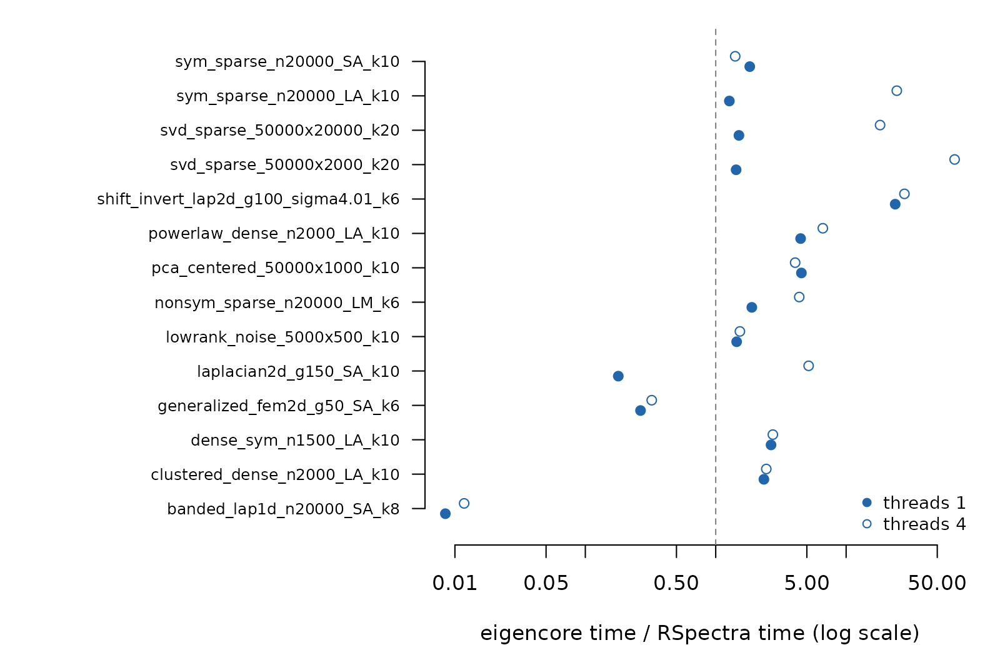
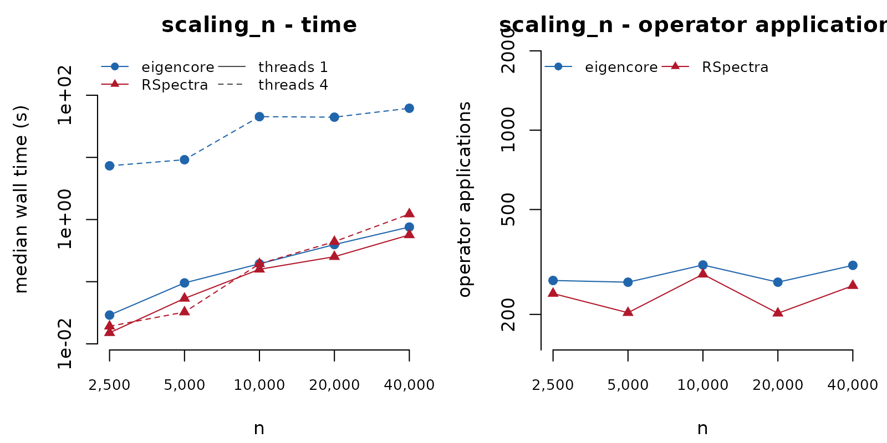
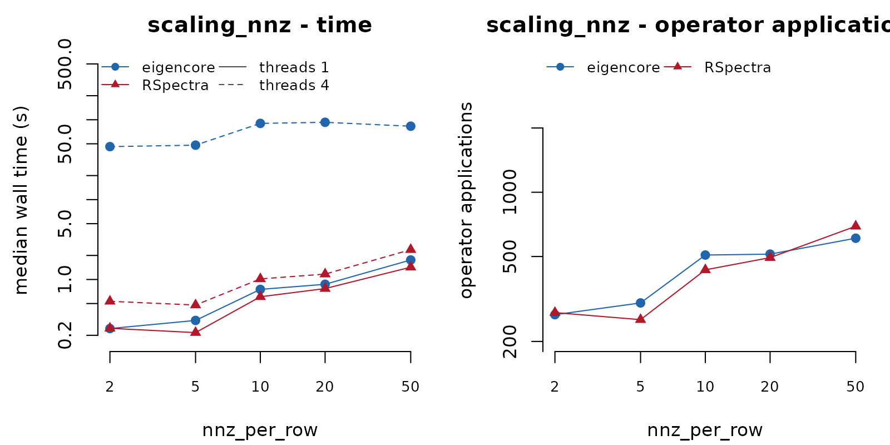
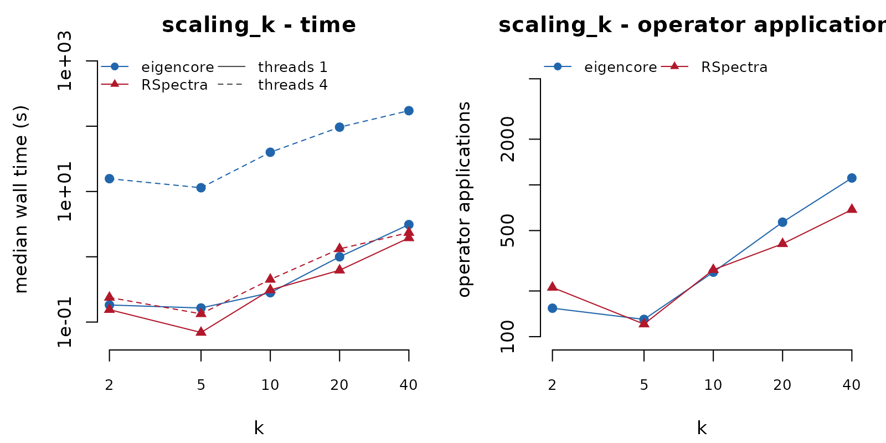
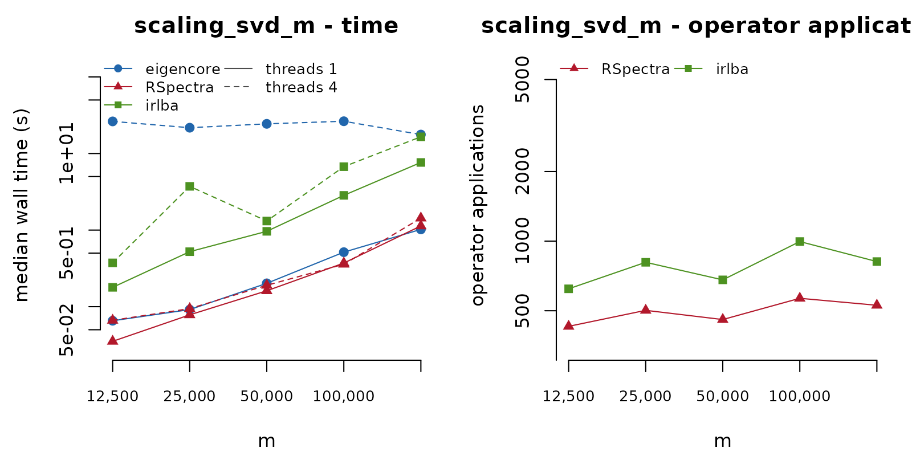
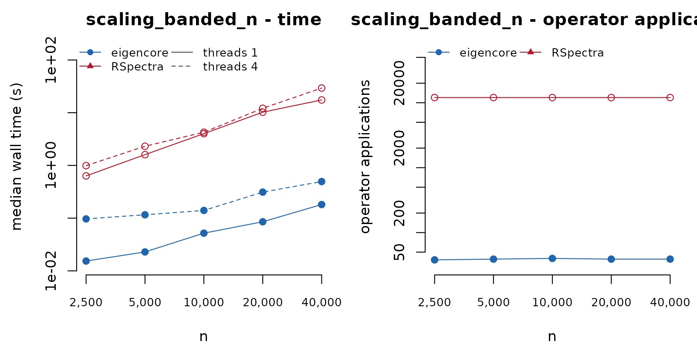

# Benchmarks: what we measure and what it means

This is a pkgdown-only article, not a CRAN vignette. It performs **no
timing at build time**: every number below is read from result
directories stored in the repository under `inst/benchmarks/results/`,
produced by the benchmark suite `inst/benchmarks/run-suite.R`.
Rebuilding the site never changes a number; adding a result directory
does.

## What is measured and why

Each **case** is a deterministic problem (fixed generator and seed) with
a wanted set: the `k` largest or smallest eigenvalues, the `k`
eigenvalues of largest modulus, the `k` eigenvalues nearest a shift, the
`k` largest singular triplets, or the full spectrum. Every **method**
(eigencore, RSpectra, irlba, PRIMME when installed, and dense base
R/LAPACK where it fits in memory) is run on the same matrix with the
same requested tolerance (`tol = 1e-8`) and, for each case and method,
the suite records:

- **wall time**: one untimed warm-up call, then the median and minimum
  over `reps` timed calls (5 in the standard profile). eigencore’s time
  always includes building its certificate; the other packages do no
  certification.
- **operator applications** (`matvecs`): the hardware-independent work
  each package reports about itself: eigencore’s
  [`work()`](https://bbuchsbaum.github.io/eigencore/reference/work.md)
  record (`operator_columns + adjoint_columns` of the solve phase),
  RSpectra’s `nops`, irlba’s `mprod`, PRIMME’s `numMatvecs`. For
  shift-invert cases an application is a linear solve. eigencore’s
  explicit-Gram SVD paths do not apply the operator column by column, so
  they report no comparable count.
- **memory**: peak resident-set growth of the process during the warm-up
  call (Linux, via `VmHWM`), which includes C/C++ heaps, and the R heap
  high-water mark. Both are in `results.csv`; neither is a cross-package
  claim.
- **accuracy**, computed by the suite itself for every method’s output,
  defined in the next section, plus eigencore’s own certificate verdict.

Threads are a property of the run: each thread setting runs in a fresh R
process with `OPENBLAS_NUM_THREADS`, `OMP_NUM_THREADS`, and
`options(eigencore.threads)` all set to the same value, so “4 threads”
means the whole process (BLAS, LAPACK and eigencore’s OpenMP kernels)
had four. RSpectra and irlba are effectively single-threaded on sparse
inputs, so their 4-thread rows mostly measure noise.

## The independent accuracy check

The suite does not trust any solver’s own residuals. For every returned
pair it recomputes

- the residual `A x - lambda B x` (`B = I` for standard problems), and
  for SVDs both sides,
  `sqrt(||A v - sigma u||^2 + ||A' u - sigma v||^2)`;
- the **normwise 2-norm backward error**
  `||r|| / ((||A||_2 + |lambda| ||B||_2) ||x||)` (SVD: `/ ||A||_2`).
  This is the definition eigencore’s own certificates use since the C12
  change, but the suite divides by a *high-accuracy* `||A||_2`: exact
  when the spectrum is known or a dense factorisation is affordable,
  otherwise a converged Golub-Kahan-Lanczos estimate with full
  reorthogonalisation, computed once per case and cached. (eigencore’s
  certificate divides by a value that never exceeds `||A||_2`, so its
  own number can only be larger.)
- the orthogonality loss `max |X' X - I|` (`X' B X - I` for generalized
  problems, `U` and `V` for SVDs);
- the **value error** against a trusted reference: the analytic spectrum
  (Laplacians, finite-element pencils, matrices built as
  `Q diag(values) Q'`), dense LAPACK when feasible, or else a tight
  iterative reference: RSpectra at `tol = 1e-13` asking for `k + 10` and
  `k + 20` values with large subspaces, and eigencore at `tol = 1e-12`.
  Each candidate is verified with the independent backward error, and
  among the accurate ones the set reaching furthest into the target wins
  (a value with a tiny backward error is a genuine eigenvalue, so a set
  that reaches further cannot be wrong where a shorter one may have
  skipped values). Disagreement between candidates is stored in
  `cases.csv`. The error is scaled like the backward error:
  `|lambda - lambda_ref| / (||A||_2 + |lambda_ref| ||B||_2)`.
- whether the method returned the **requested target set**
  (`target_ok`): `k` values, each matched to a distinct reference value
  within a gap-aware tolerance, and every matched reference value inside
  the wanted set (ties at the boundary, such as repeated eigenvalues and
  conjugate pairs, count as inside). A small backward error does not
  imply the right target set: a Krylov method can converge accurately to
  the wrong eigenvalues, or return one copy of a repeated eigenvalue and
  skip the other.

In the tables below a time is marked † when the method did **not**
return the wanted set, and ‡ when its independent backward error exceeds
`1e-6`. Such times are not comparable with correct ones.

## Result sets

|  | 20261009-3d7cb0dd-standard | 20261009-3d7cb0dd-scaling |
|:---|:---|:---|
| run | 20261009-3d7cb0dd-standard | 20261009-3d7cb0dd-scaling |
| date | 2026-10-09T19:28:29Z | 2026-10-09T19:48:13Z |
| machine | 3d7cb0dd | 3d7cb0dd |
| cpu | Intel(R) Xeon(R) Processor @ 2.10GHz (4 logical / 4 physical cores, 15.7 GB) | Intel(R) Xeon(R) Processor @ 2.10GHz (4 logical / 4 physical cores, 15.7 GB) |
| R | 4.3.3 (2024-02-29) | 4.3.3 (2024-02-29) |
| platform | x86_64-pc-linux-gnu | x86_64-pc-linux-gnu |
| BLAS | OpenBLAS (libopenblasp-r0.3.26.so) | OpenBLAS (libopenblasp-r0.3.26.so) |
| eigencore | 1.3.0 @ bf11055cbd | 1.3.0 @ bf11055cbd |
| competitors | RSpectra 0.16.1, irlba 2.3.5.1 | RSpectra 0.16.1, irlba 2.3.5.1 |
| threads | 1,4 | 1,4 |
| blas_threads | 1:1 4:4 | 1:1 4:4 |
| reps | 5 | 3 |
| load_start_end | 1.77 / 7.56 | 10.89 / 11.75 |
| wall | 1070 s | 2674 s |

Environment of each stored result set (one column per run). {.table}

| case | generator | nnz | reference values | \|\|A\|\|\_2 |
|:---|:---|:---|:---|:---|
| sym_sparse_n20000_LA_k10 | random sparse symmetric, n=20000, ~5 nnz/row, N(0,1) values | 99,998 | certified iterative: RSpectra(k=30, tol=1e-13), independent backward error 1.6e-14; candidates RSpectra(k=20, tol=1e-13) (bwd 7.4e-15), RSpectra(k=30, tol=1e-13) (bwd 1.6e-14), eigencore(k=20, tol=1e-12) (bwd 6.5e-13); max top-k disagreement 1.6e-14 | Golub-Kahan-Lanczos (44 steps, full reorth.) |
| sym_sparse_n20000_SA_k10 | random sparse symmetric, n=20000, ~5 nnz/row, N(0,1) values | 99,998 | certified iterative: RSpectra(k=30, tol=1e-13), independent backward error 1.2e-14; candidates RSpectra(k=20, tol=1e-13) (bwd 6.7e-15), RSpectra(k=30, tol=1e-13) (bwd 1.2e-14), eigencore(k=20, tol=1e-12) (bwd 6.5e-13); max top-k disagreement 9.9e-15 | Golub-Kahan-Lanczos (44 steps, full reorth.) |
| nonsym_sparse_n20000_LM_k6 | random sparse nonsymmetric, n=20000, ~5 nnz/row, N(0,1) values | 100,000 | certified iterative: RSpectra(k=16, tol=1e-13), independent backward error 9.4e-14; candidates RSpectra(k=16, tol=1e-13) (bwd 9.4e-14), RSpectra(k=26, tol=1e-13) (bwd 2.1e-14), eigencore(k=16, tol=1e-12) (bwd 2.4e-13); max top-k disagreement 3.8e-01 | Golub-Kahan-Lanczos (60 steps, full reorth.) |
| svd_sparse_50000x2000_k20 | random sparse 50000 x 2000, density 0.002, N(0,1) values | 200,000 | dense LAPACK eigen() of the Gram matrix (top singular values) | exact (dense Gram eigen) |
| svd_sparse_50000x20000_k20 | random sparse 50000 x 20000, density 0.0005, N(0,1) values | 500,000 | certified iterative: RSpectra(k=30, tol=1e-13), independent backward error 4.6e-14; candidates RSpectra(k=30, tol=1e-13) (bwd 4.6e-14), RSpectra(k=40, tol=1e-13) (bwd 2.4e-14), eigencore(k=30, tol=1e-12) (bwd 8.9e-13); max top-k disagreement 8.4e-15 | Golub-Kahan-Lanczos (36 steps, full reorth.) |
| dense_sym_n1500_LA_k10 | dense symmetric crossprod(X)/n, X 1500 x 1500 N(0,1) | 2,250,000 | dense LAPACK eigen() | exact (dense eigen) |
| eig_full_n1500_vectors | dense symmetric crossprod(X)/n, X 1500 x 1500 N(0,1) | 2,250,000 | dense LAPACK eigen() | exact (dense eigen) |
| eig_full_n1500_values | dense symmetric crossprod(X)/n, X 1500 x 1500 N(0,1) | 2,250,000 | dense LAPACK eigen() | exact (dense eigen) |
| shift_invert_lap2d_g100_sigma4.01_k6 | 2-D 5-point Dirichlet Laplacian, 100 x 100 grid (n=10000); analytic spectrum, repeated eigenvalues | 49,600 | analytic spectrum | exact (analytic spectrum) |
| generalized_fem2d_g50_SA_k6 | generalized SPD FEM pencil (Q1 stiffness/mass), 50 x 50 grid (n=2500); analytic spectrum | 21,904 | analytic spectrum | Golub-Kahan-Lanczos (80 steps, full reorth.) |
| pca_centered_50000x1000_k10 | random sparse 50000 x 1000, density 0.01, Exp(1) values | 500,000 | dense LAPACK eigen() of the Gram matrix (top singular values) | exact (dense Gram eigen) |
| banded_lap1d_n20000_SA_k8 | 1-D Dirichlet Laplacian (tridiagonal), n=20000; analytic spectrum | 59,998 | analytic spectrum | exact (analytic spectrum) |
| laplacian2d_g150_SA_k10 | 2-D 5-point Dirichlet Laplacian, 150 x 150 grid (n=22500); analytic spectrum, repeated eigenvalues | 111,900 | analytic spectrum | exact (analytic spectrum) |
| powerlaw_dense_n2000_LA_k10 | dense symmetric Q diag(j^-1) Q’, n=2000; analytic spectrum | 4,000,000 | analytic spectrum | exact (analytic spectrum) |
| clustered_dense_n2000_LA_k10 | dense symmetric, n=2000, top spectrum 1 (x3), 1-1e-6..3e-6, 0.9 (x2), 0.85, 0.8, bulk U(0,0.7); analytic | 4,000,000 | analytic spectrum | exact (analytic spectrum) |
| lowrank_noise_5000x500_k10 | dense 5000 x 500, rank-12 signal (s = 10..0.83) + 0.01 N(0,1) noise | 2,500,000 | dense LAPACK eigen() of the Gram matrix (top singular values) | exact (dense Gram eigen) |

Cases of the standard profile. {.table}

## Standard profile results

### Sparse symmetric, extreme eigenvalues

| case | threads | eigencore | RSpectra | base | eigencore / RSpectra | matvecs ec / RS | bwd err ec | bwd err RS | certified |
|:---|:---|:---|:---|:---|:---|:---|:---|:---|:---|
| sym_sparse_n20000_LA_k10 | 1 | 278 ms | 219 ms | n/a | 1.27 | 268 / 230 | 9.3e-09 | 2.4e-09 | yes |
| sym_sparse_n20000_LA_k10 | 4 | 6.53 s | 267 ms | n/a | 24.48 | 268 / 230 | 9.3e-09 | 2.4e-09 | yes |
| sym_sparse_n20000_SA_k10 | 1 | 375 ms | 206 ms | n/a | 1.82 | 348 / 236 | 6.3e-09 | 4.4e-09 | yes |
| sym_sparse_n20000_SA_k10 | 4 | 312 ms | 221 ms | n/a | 1.41 | 305 / 236 | 5.2e-09 | 4.4e-09 | yes |

### Sparse nonsymmetric, largest modulus

| case | threads | eigencore | RSpectra | base | eigencore / RSpectra | matvecs ec / RS | bwd err ec | bwd err RS | certified |
|:---|:---|:---|:---|:---|:---|:---|:---|:---|:---|
| nonsym_sparse_n20000_LM_k6 | 1 | 4.75 s† | 2.51 s† | n/a | 1.89 | 6576 / 3947 | 2.6e-09 (miss) | 2.6e-09 (miss) | yes |
| nonsym_sparse_n20000_LM_k6 | 4 | 9.70 s† | 2.22 s† | n/a | 4.37 | 6576 / 3947 | 2.6e-09 (miss) | 2.6e-09 (miss) | yes |

### Sparse SVD

| case | threads | eigencore | RSpectra | irlba | base | eigencore / RSpectra | matvecs ec / RS | bwd err ec | bwd err RS | certified |
|:---|:---|:---|:---|:---|:---|:---|:---|:---|:---|:---|
| svd_sparse_50000x2000_k20 | 1 | 195 ms | 136 ms | 919 ms | n/a | 1.43 | \- / 486 | 8.3e-10 | 1.8e-09 | yes |
| svd_sparse_50000x2000_k20 | 4 | 8.96 s | 132 ms | 780 ms | n/a | 67.94 | \- / 486 | 8.3e-10 | 1.8e-09 | yes |
| svd_sparse_50000x20000_k20 | 1 | 1.13 s | 750 ms | 2.22 s | n/a | 1.51 | \- / 602 | 2.3e-10 | 7.1e-09 | yes |
| svd_sparse_50000x20000_k20 | 4 | 13.9 s | 762 ms | 2.45 s | n/a | 18.22 | \- / 602 | 2.3e-10 | 7.1e-09 | yes |

### Dense symmetric, partial

| case | threads | eigencore | RSpectra | base | eigencore / RSpectra | matvecs ec / RS | bwd err ec | bwd err RS | certified |
|:---|:---|:---|:---|:---|:---|:---|:---|:---|:---|
| dense_sym_n1500_LA_k10 | 1 | 198 ms | 74 ms | 682 ms | 2.66 | 182 / 169 | 6.1e-09 | 1.2e-09 | yes |
| dense_sym_n1500_LA_k10 | 4 | 186 ms | 68 ms | 596 ms | 2.74 | 182 / 169 | 6.6e-09 | 1.2e-09 | yes |

### Full dense eigendecomposition

| case                   | threads | eigencore | base   | bwd err ec | certified |
|:-----------------------|:--------|:----------|:-------|:-----------|:----------|
| eig_full_n1500_vectors | 1       | 858 ms    | 700 ms | 2.0e-15    | yes       |
| eig_full_n1500_vectors | 4       | 481 ms    | 386 ms | 1.8e-15    | yes       |
| eig_full_n1500_values  | 1       | 328 ms    | 349 ms | \-         | \-        |
| eig_full_n1500_values  | 4       | 157 ms    | 140 ms | \-         | \-        |

### Interior eigenvalues by shift-invert

| case | threads | eigencore | RSpectra | base | eigencore / RSpectra | matvecs ec / RS | bwd err ec | bwd err RS | certified |
|:---|:---|:---|:---|:---|:---|:---|:---|:---|:---|
| shift_invert_lap2d_g100_sigma4.01_k6 | 1 | 971 ms | 41 ms | n/a | 23.79 | 45 / 41 | 2.2e-16 | 6.4e-14 | yes |
| shift_invert_lap2d_g100_sigma4.01_k6 | 4 | 1.10 s | 39 ms | n/a | 28.00 | 45 / 41 | 2.2e-16 | 6.4e-14 | yes |

### Generalized symmetric-definite

| case | threads | eigencore | RSpectra | base | eigencore / RSpectra | matvecs ec / RS | bwd err ec | bwd err RS | certified |
|:---|:---|:---|:---|:---|:---|:---|:---|:---|:---|
| generalized_fem2d_g50_SA_k6 | 1 | 182 ms | 686 ms | 6.68 s | 0.27 | \- / 1042 | 8.1e-09 | 6.0e-11 | yes |
| generalized_fem2d_g50_SA_k6 | 4 | 187 ms | 580 ms | 4.62 s | 0.32 | \- / 1042 | 8.1e-09 | 6.0e-11 | yes |

### Centred sparse PCA (implicit centring)

| case | threads | eigencore | RSpectra | irlba | base | eigencore / RSpectra | matvecs ec / RS | bwd err ec | bwd err RS | certified |
|:---|:---|:---|:---|:---|:---|:---|:---|:---|:---|:---|
| pca_centered_50000x1000_k10 | 1 | 1.31 s | 288 ms | 508 ms | n/a | 4.54 | 570 / 330 | 6.2e-10 | 6.1e-09 | yes |
| pca_centered_50000x1000_k10 | 4 | 1.41 s | 346 ms | 511 ms | n/a | 4.07 | 570 / 330 | 6.2e-10 | 6.1e-09 | yes |

### Banded (1-D Laplacian), smallest

| case | threads | eigencore | RSpectra | base | eigencore / RSpectra | matvecs ec / RS | bwd err ec | bwd err RS | certified |
|:---|:---|:---|:---|:---|:---|:---|:---|:---|:---|
| banded_lap1d_n20000_SA_k8 | 1 | 56 ms | 6.59 s† | n/a | 0.01 | 39 / 12020 | 1.2e-10 | \- (miss) | yes |
| banded_lap1d_n20000_SA_k8 | 4 | 78 ms | 6.62 s† | n/a | 0.01 | 39 / 12020 | 1.2e-10 | \- (miss) | yes |

### 2-D Laplacian, smallest (repeated eigenvalues)

| case | threads | eigencore | RSpectra | base | eigencore / RSpectra | matvecs ec / RS | bwd err ec | bwd err RS | certified |
|:---|:---|:---|:---|:---|:---|:---|:---|:---|:---|
| laplacian2d_g150_SA_k10 | 1 | 1.20 s† | 6.68 s† | n/a | 0.18 | 1214 / 6488 | 5.5e-09 (miss) | 3.1e-13 (miss) | yes |
| laplacian2d_g150_SA_k10 | 4 | 34.0 s† | 6.59 s† | n/a | 5.16 | 1260 / 6488 | 2.7e-09 (miss) | 3.1e-13 (miss) | yes |

### Power-law spectrum

| case | threads | eigencore | RSpectra | base | eigencore / RSpectra | matvecs ec / RS | bwd err ec | bwd err RS | certified |
|:---|:---|:---|:---|:---|:---|:---|:---|:---|:---|
| powerlaw_dense_n2000_LA_k10 | 1 | 139 ms | 31 ms | 1.42 s | 4.48 | 66 / 40 | 2.7e-16 | 7.7e-13 | yes |
| powerlaw_dense_n2000_LA_k10 | 4 | 240 ms | 36 ms | 2.07 s | 6.63 | 66 / 40 | 3.8e-16 | 7.7e-13 | yes |

### Clustered / repeated top eigenvalues

| case | threads | eigencore | RSpectra | base | eigencore / RSpectra | matvecs ec / RS | bwd err ec | bwd err RS | certified |
|:---|:---|:---|:---|:---|:---|:---|:---|:---|:---|
| clustered_dense_n2000_LA_k10 | 1 | 244 ms | 104 ms | 1.84 s | 2.34 | 141 / 127 | 1.6e-11 | 8.0e-11 | yes |
| clustered_dense_n2000_LA_k10 | 4 | 236 ms | 97 ms | 2.28 s | 2.44 | 141 / 127 | 2.5e-12 | 9.7e-11 | yes |

### Low rank plus noise SVD

| case | threads | eigencore | RSpectra | irlba | base | eigencore / RSpectra | matvecs ec / RS | bwd err ec | bwd err RS | certified |
|:---|:---|:---|:---|:---|:---|:---|:---|:---|:---|:---|
| lowrank_noise_5000x500_k10 | 1 | 67 ms | 46 ms | 48 ms | 355 ms | 1.45 | \- / 52 | 9.9e-16 | 3.8e-14 | yes |
| lowrank_noise_5000x500_k10 | 4 | 81 ms | 53 ms | 53 ms | 409 ms | 1.53 | \- / 52 | 1.3e-15 | 3.8e-14 | yes |

### Time relative to RSpectra

Ratios below one mean faster than RSpectra on the same machine and
thread setting.



### Operator applications

Operator applications are the hardware-independent part of the
comparison: they do not change with the machine, the BLAS, or the load.
A dash means the package reported no comparable count (dense LAPACK,
explicit Gram paths).

| case_id                              | eigencore | RSpectra | irlba |
|:-------------------------------------|:----------|:---------|:------|
| sym_sparse_n20000_LA_k10             | 268       | 230      | \-    |
| sym_sparse_n20000_SA_k10             | 348       | 236      | \-    |
| nonsym_sparse_n20000_LM_k6           | 6576      | 3947     | \-    |
| svd_sparse_50000x2000_k20            | \-        | 486      | 756   |
| svd_sparse_50000x20000_k20           | \-        | 602      | 1096  |
| dense_sym_n1500_LA_k10               | 182       | 169      | \-    |
| eig_full_n1500_vectors               | \-        | \-       | \-    |
| eig_full_n1500_values                | \-        | \-       | \-    |
| shift_invert_lap2d_g100_sigma4.01_k6 | 45        | 41       | \-    |
| generalized_fem2d_g50_SA_k6          | \-        | 1042     | \-    |
| pca_centered_50000x1000_k10          | 570       | 330      | 390   |
| banded_lap1d_n20000_SA_k8            | 39        | 12020    | \-    |
| laplacian2d_g150_SA_k10              | 1214      | 6488     | \-    |
| powerlaw_dense_n2000_LA_k10          | 66        | 40       | \-    |
| clustered_dense_n2000_LA_k10         | 141       | 127      | \-    |
| lowrank_noise_5000x500_k10           | \-        | 52       | 48    |

Operator applications (A and A’ counted separately) at threads = 1.
{.table}

### Accuracy summary

| case_id | eigencore | RSpectra | irlba | base |
|:---|:---|:---|:---|:---|
| sym_sparse_n20000_LA_k10 | 9.3e-09 / 1.7e-14 / ok, cert | 2.4e-09 / 1.6e-14 / ok | \- | n/a |
| sym_sparse_n20000_SA_k10 | 6.3e-09 / 1.0e-14 / ok, cert | 4.4e-09 / 7.4e-15 / ok | \- | n/a |
| nonsym_sparse_n20000_LM_k6 | 2.6e-09 / 7.4e-11 / MISS, cert | 2.6e-09 / 8.2e-02 / MISS | \- | n/a |
| svd_sparse_50000x2000_k20 | 8.3e-10 / 3.3e-15 / ok, cert | 1.8e-09 / 3.0e-15 / ok | 8.6e-09 / 4.5e-15 / ok | n/a |
| svd_sparse_50000x20000_k20 | 2.3e-10 / 8.4e-15 / ok, cert | 7.1e-09 / 6.0e-15 / ok | 8.2e-09 / 1.0e-14 / ok | n/a |
| dense_sym_n1500_LA_k10 | 6.1e-09 / 5.4e-15 / ok, cert | 1.2e-09 / 5.5e-15 / ok | \- | 8.2e-16 / 5.3e-15 / ok |
| eig_full_n1500_vectors | 2.0e-15 / 5.4e-15 / ok, cert | \- | \- | 1.8e-15 / 5.3e-15 / ok |
| eig_full_n1500_values | \- / 5.5e-15 / ok | \- | \- | \- / 0.0e+00 / ok |
| shift_invert_lap2d_g100_sigma4.01_k6 | 2.2e-16 / 7.4e-17 / ok, cert | 6.4e-14 / 8.9e-16 / ok | \- | n/a |
| generalized_fem2d_g50_SA_k6 | 8.1e-09 / 1.2e-15 / ok, cert | 6.0e-11 / 2.3e-13 / ok | \- | 2.2e-15 / 2.5e-16 / ok |
| pca_centered_50000x1000_k10 | 6.2e-10 / 1.9e-15 / ok, cert | 6.1e-09 / 1.8e-15 / ok | 9.4e-09 / 4.0e-15 / ok | n/a |
| banded_lap1d_n20000_SA_k8 | 1.2e-10 / 2.8e-17 / ok, cert | \- / - / MISS | \- | n/a |
| laplacian2d_g150_SA_k10 | 5.5e-09 / 1.2e-15 / MISS, cert | 3.1e-13 / 3.1e-13 / MISS | \- | n/a |
| powerlaw_dense_n2000_LA_k10 | 2.7e-16 / 1.5e-16 / ok, cert | 7.7e-13 / 1.3e-15 / ok | \- | 3.8e-16 / 1.7e-16 / ok |
| clustered_dense_n2000_LA_k10 | 1.6e-11 / 4.3e-16 / ok, cert | 8.0e-11 / 2.0e-15 / ok | \- | 1.4e-15 / 1.4e-15 / ok |
| lowrank_noise_5000x500_k10 | 9.9e-16 / 1.2e-16 / ok, cert | 3.8e-14 / 3.9e-16 / ok | 6.0e-15 / 7.7e-16 / ok | 9.1e-15 / 7.1e-16 / ok |

Independent backward error / scaled value error / target set (“cert”:
eigencore’s own certificate passed). threads = 1. {.table}

**Rows where a method missed the wanted set or eigencore’s certificate
failed** (generated from the stored results):

- `nonsym_sparse_n20000_LM_k6`, eigencore: returned the wrong or an
  incomplete target set; eigencore’s certificate nevertheless passed
  (value error 7.4e-11, backward error 2.6e-09).
- `nonsym_sparse_n20000_LM_k6`, RSpectra: returned the wrong or an
  incomplete target set (value error 8.2e-02, backward error 2.6e-09).
- `banded_lap1d_n20000_SA_k8`, RSpectra: returned the wrong or an
  incomplete target set (value error -, backward error -).
- `laplacian2d_g150_SA_k10`, eigencore: returned the wrong or an
  incomplete target set; eigencore’s certificate nevertheless passed
  (value error 1.2e-15, backward error 5.5e-09).
- `laplacian2d_g150_SA_k10`, RSpectra: returned the wrong or an
  incomplete target set (value error 3.1e-13, backward error 3.1e-13).

A residual certificate checks that each returned pair is accurate; it
does not by itself prove that no wanted eigenvalue was skipped, which is
what the target-set column measures.

## Scaling

The scaling profile sweeps one variable at a time: the dimension `n` of
a random sparse symmetric matrix (5 nonzeros per row), its density at
`n = 20000`, the number of wanted eigenvalues `k`, the long side of a
sparse `m x 2000` SVD, and the dimension of the 1-D Laplacian, whose
smallest eigenvalues have gaps shrinking like `1/n^2`. Solid lines are 1
thread, dashed lines 4 threads; open symbols mark results that missed
the wanted set.



| group            | method    | threads | slope |
|:-----------------|:----------|--------:|------:|
| scaling_n        | eigencore |       1 |  1.15 |
| scaling_n        | RSpectra  |       1 |  1.27 |
| scaling_n        | eigencore |       4 |  0.84 |
| scaling_n        | RSpectra  |       4 |  1.58 |
| scaling_nnz      | eigencore |       1 |  0.64 |
| scaling_nnz      | RSpectra  |       1 |  0.61 |
| scaling_nnz      | eigencore |       4 |  0.23 |
| scaling_nnz      | RSpectra  |       4 |  0.49 |
| scaling_k        | eigencore |       1 |  0.99 |
| scaling_k        | RSpectra  |       1 |  0.95 |
| scaling_k        | eigencore |       4 |  0.92 |
| scaling_k        | RSpectra  |       4 |  0.90 |
| scaling_svd_m    | eigencore |       1 |  1.04 |
| scaling_svd_m    | RSpectra  |       1 |  1.23 |
| scaling_svd_m    | irlba     |       1 |  1.33 |
| scaling_svd_m    | eigencore |       4 | -0.09 |
| scaling_svd_m    | RSpectra  |       4 |  1.08 |
| scaling_svd_m    | irlba     |       4 |  1.18 |
| scaling_banded_n | eigencore |       1 |  0.90 |
| scaling_banded_n | RSpectra  |       1 |  1.22 |
| scaling_banded_n | eigencore |       4 |  0.61 |
| scaling_banded_n | RSpectra  |       4 |  1.22 |

Fitted log-log slope of median time against the swept variable. {.table}

## How to reproduce or add your machine

Install eigencore from the commit you want to measure into a private
library and run the suite from the repository root:

``` sh
R CMD INSTALL --preclean --no-docs -l .rlib .
Rscript inst/benchmarks/run-suite.R --lib=.rlib --profile=quick              # ~2 min smoke run
Rscript inst/benchmarks/run-suite.R --lib=.rlib --profile=standard --threads=1,4
Rscript inst/benchmarks/run-suite.R --lib=.rlib --profile=scaling  --threads=1,4
```

Useful options: `--families=sym_sparse,svd_sparse` (or a sweep such as
`scaling_k`), `--cases=<substring>`,
`--methods=eigencore,RSpectra,irlba,base,PRIMME`, `--reps=N`,
`--suitesparse` (adds a few SuiteSparse Matrix Collection matrices,
downloaded once into the cache and skipped when offline), and `--list`
to print the selected cases. Each run writes
`inst/benchmarks/results/<YYYYMMDD>-<machine-id>-<profile>/` containing
`results.csv` (one row per case, method and thread setting), `cases.csv`
(generators, reference sources and `||A||_2`), and
`environment.json`/`.rds` (CPU, cores, R, BLAS/LAPACK library and
threads, package versions, eigencore git SHA, load average). The machine
id is a hash; no hostname is stored.

To add your machine, commit that directory; this article and the README
table pick up the newest run per machine and profile. Summaries are
available without rebuilding the site:

``` sh
Rscript inst/benchmarks/report.R inst/benchmarks/results/<run-dir>
```

The `benchmarks` GitHub workflow (manual dispatch, inputs `profile` and
`threads`) runs the same command on `ubuntu-latest` with OpenBLAS and
uploads the result directory as an artifact; it never commits results.

## Limits

- **Shared, noisy hardware.** Stored results may come from a shared
  container whose load varies while the suite runs; the environment
  table records the load average at the start and end, and `results.csv`
  keeps every repetition (`times`) and the per-row load. Medians absorb
  short spikes, not sustained contention. Multithreaded rows are the
  most sensitive: an OpenMP region on an oversubscribed machine can be
  an order of magnitude slower than on an idle one, which is why matvec
  counts are reported alongside times.
- **BLAS dependence.** Dense cases and eigencore’s blocked kernels
  depend on the BLAS/LAPACK library and its threads; RSpectra uses
  Eigen’s own kernels. Compare rows only within one result set, and
  check the BLAS line of its environment.
- **Random matrices are not real matrices.** Most cases are synthetic
  with known structure (random sparsity, Laplacians, prescribed
  spectra). Real matrices have different sparsity patterns, spectra and
  conditioning; the optional SuiteSparse cases are a first step, and
  your own matrices are the only benchmark that settles a choice.
- **Different stopping rules.** All methods receive `tol = 1e-8`, but
  each package interprets it differently (RSpectra relative to the Ritz
  value, irlba relative to the largest singular value, eigencore as a
  backward error with a certificate). The independent accuracy columns
  are there so that a fast but inaccurate or incomplete answer is
  visible.
- **What the times include.** eigencore’s time includes certification
  and result construction; dense base R rows include
  [`as.matrix()`](https://rdrr.io/r/base/matrix.html); the RSpectra
  generalized row includes the sparse Cholesky factorisation.
